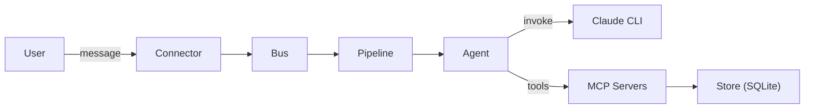

# AwfulClaw

An autonomous AI agent that lives on my Mac Mini and uses claude to do things. Communicates via Telegram, REST API, and more. Integrates directly with the Apple ecosystem of reminders, calendars and contacts. Uses IMAP to read emails.

## Requirements

- Python 3.12+
- [`uv`](https://github.com/astral-sh/uv)
- Claude CLI installed and oauth authenticated (`claude` command available)

## Running

```bash
# Install and start as a launchd service (runs at login, restarts on crash)
scripts/install_service.sh

# Remove the service
scripts/uninstall_service.sh

# Run directly (dev/debug)
scripts/start_agent.sh
```

## Architecture



**Packages:**

| Package | Purpose |
|---------|---------|
| `agent/connectors/` | Telegram + REST transports |
| `agent/middleware/` | Rate limiting, slash commands, location, typing, invocation |
| `agent/handlers/` | Check-in, orientation, governance, knowledge flush |
| `agent/mcp/` | Tool servers (memory, schedule, calendar, contacts, email, weather, etc.) |
| `agent/store.py` | Unified SQLite layer with semantic search (sqlite-vec) |
| `agent/context.py` | Dynamic system prompt assembly |
| `agent/scheduler.py` | Cron + one-shot scheduling |
| `agent/agent.py` | Claude invocation and turn storage |

## Environment Variables Configuration

Copy `.env.example` to `.env` and fill in. All variables are prefixed `AWFULCLAW_`.

### Required

| Variable | Description |
|----------|-------------|
| `AWFULCLAW_TELEGRAM__BOT_TOKEN` | Telegram bot token |
| `AWFULCLAW_TELEGRAM__ALLOWED_CHAT_IDS` | JSON array of allowed chat IDs, e.g. `[123456]` |

### Backend

| Variable | Default | Description |
|----------|---------|-------------|
| `AWFULCLAW_BACKEND__PROVIDER` | `claude` | Primary LLM backend (`claude` or `ollama`) |
| `AWFULCLAW_BACKEND__FALLBACK` | `ollama` | Fallback backend; empty string disables fallback and locks the provider |
| `AWFULCLAW_BACKEND__CLAUDE_MODEL` | `claude-sonnet-4-6` | Claude model name |
| `AWFULCLAW_BACKEND__OLLAMA_MODEL` | `llama3.2` | Ollama model name |
| `AWFULCLAW_BACKEND__OLLAMA_URL` | `http://localhost:11434` | Ollama server URL |
| `AWFULCLAW_BACKEND__FAILURE_THRESHOLD` | `3` | Consecutive failures before switching to fallback |
| `AWFULCLAW_BACKEND__PROBE_INTERVAL` | `600` | Seconds between primary health checks when on fallback |

### Agent

| Variable | Default | Description |
|----------|---------|-------------|
| `AWFULCLAW_GOVERNANCE_MODEL` | `claude-haiku-4-5-20251001` | Model used for governance/policy checks |
| `AWFULCLAW_POLL_INTERVAL` | `5` | Seconds between message queue polls |
| `AWFULCLAW_IDLE_INTERVAL` | `14400` | Seconds of inactivity before an idle check-in (4 hours) |
| `AWFULCLAW_CHECKIN_INTERVAL` | `86400` | Seconds between scheduled check-ins (24 hours) |
| `AWFULCLAW_STATE_PATH` | `state` | Directory for SQLite database and persistent state |
| `AWFULCLAW_PROFILE_PATH` | `profile` | Directory for personality/protocol markdown files |
| `AWFULCLAW_MCP_CONFIG` | `config/mcp_servers.json` | Path to MCP server definitions |
| `AWFULCLAW_OBSIDIAN_VAULT` | `obsidian` | Path to Obsidian vault for file access |

### Transcription

| Variable | Default | Description |
|----------|---------|-------------|
| `AWFULCLAW_TRANSCRIPTION_ENABLED` | `true` | Enable voice message transcription via Parakeet |
| `AWFULCLAW_PARAKEET_MODEL` | `nvidia/parakeet-tdt-0.6b-v3` | Parakeet model for speech-to-text |

### Optional integrations

| Variable | Default | Description |
|----------|---------|-------------|
| `AWFULCLAW_IMAP__HOST` | | IMAP server hostname |
| `AWFULCLAW_IMAP__PORT` | `993` | IMAP port |
| `AWFULCLAW_IMAP__USERNAME` | | IMAP username |
| `AWFULCLAW_IMAP__PASSWORD` | | IMAP password |
| `AWFULCLAW_EVENTKIT__ENABLED` | `true` | Enable EventKit calendar access |
| `AWFULCLAW_CONTACTS__ENABLED` | `true` | Enable Contacts access |
| `AWFULCLAW_OWNTRACKS__URL` | | OwnTracks HTTP receiver URL |

Agent personality and protocols live in `profile/`:

| File | Purpose |
|------|---------|
| `PERSONALITY.md` | Identity, behavior, constraints |
| `PROTOCOLS.md` | Communication rules, escalation |
| `USER.md` | User profile and preferences |
| `CHECKIN.md` | Idle/check-in prompts |

## Documentation

| Document | Purpose |
|----------|---------|
| `DESIGN.md` | Original architecture spec — historical reference |
| `PHILOSOPHY.md` | Design values, data philosophy, governance model |
| `CLAUDE.md` | Guidance for Claude Code when working in this repo |

## Testing

```bash
uv run pytest
```
