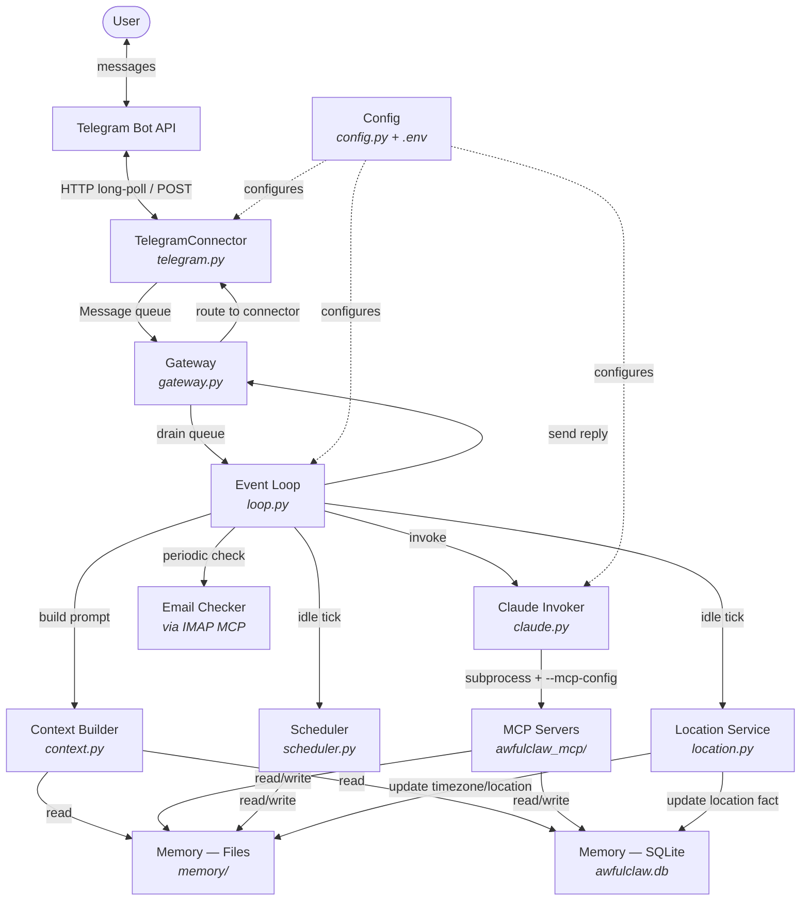

# Architecture

This document describes the current high-level architecture of awfulclaw to guide a complete refactoring. It focuses on systems and their interactions rather than implementation details. For contribution workflows, see `CLAUDE.md`.

## Overview

awfulclaw is an autonomous AI agent that runs an async poll-and-event loop, communicates with users via Telegram, and invokes Claude through the `claude` CLI as a subprocess. Tool access is provided via the Model Context Protocol (MCP), and persistent memory is split across markdown files and a SQLite database under `memory/`. No API key is required — authentication comes from the locally installed `claude` CLI.

## System Interaction Diagram



## Systems

### Event Loop

**Responsibility:** Orchestrates the agent's three concurrent execution paths — message handling, idle ticks, and email checks — via `asyncio.gather()`.

**Files:** `app/awfulclaw/loop.py` (~437 lines)

**Key interfaces:**
- `run(gateway)` — single async entry point, runs forever
- `_handle_messages(messages)` — processes inbound messages, invokes Claude, sends replies
- `_run_idle_tick()` — fires schedules, reloads MCP config, checks location, runs heartbeat
- `_check_new_emails()` — fetches unread emails and triages via Claude

**Timing:**
| Interval | Default | Env var |
|----------|---------|---------|
| Poll tick | 5s | `AWFULCLAW_POLL_INTERVAL` |
| Idle tick | 60s | `AWFULCLAW_IDLE_INTERVAL` |
| Idle nudge cooldown | 24h | `AWFULCLAW_IDLE_NUDGE_COOLDOWN` |
| Email check | 5m | `AWFULCLAW_EMAIL_CHECK_INTERVAL` |

**Main loop pseudocode:**
```
while True:
    messages = gateway.get_messages()        # non-blocking drain
    tasks = []
    if messages:       tasks.append(_handle_messages(messages))
    if idle_timer_due: tasks.append(_run_idle_tick())
    if email_due:      tasks.append(_check_new_emails())
    await asyncio.gather(*tasks)
    await asyncio.sleep(poll_interval)
```

**Interceptors baked into the loop:**
- **Secret request** — `<secret:request key="..."/>` in Claude's reply triggers capture of the user's next message as a credential, stored atomically to `.env`
- **Location tag** — `[Location: lat, lon]` messages are parsed and saved to the facts DB, not forwarded to Claude
- **Slash commands** — `/schedules` (list active schedules), `/restart` (trigger service restart)

### Gateway and Connectors

**Responsibility:** Gateway multiplexes one or more Connectors into a unified thread-safe inbound queue and routes outbound messages back to the correct connector.

**Files:** `app/awfulclaw/gateway.py` (~100 lines), `app/awfulclaw/connector.py` (~35 lines), `app/awfulclaw/telegram.py` (~187 lines)

**Key interfaces:**
- `Connector` ABC — `poll_new_messages(since)`, `send_message(to, body)`, `send_typing(to)`
- `Gateway` — `start()` spawns per-connector polling threads; `get_messages()` drains queue; `send(channel, to, body)` routes outbound
- `Message` dataclass — `sender`, `body`, `timestamp`, `is_from_me`, `image_data`, `image_mime`, `channel`

**TelegramConnector specifics:**
- HTTP long-polling with 30s timeout to `/getUpdates`
- Offset persisted to `memory/.telegram_offset` (survives restarts)
- Rate limiting: max 10 messages per 60-second window
- Message truncation at 4000 characters
- Photo support: downloads largest variant, passes as `image_data` bytes

### Claude Invocation

**Responsibility:** Invokes Claude via CLI subprocess (text) or Anthropic SDK (images) and returns the response.

**Files:** `app/awfulclaw/claude.py` (~235 lines)

**Key interfaces:**
- `chat(messages, system, image_data, image_mime, mcp_config_path)` — dispatches to `_chat_cli` or `_chat_sdk`
- `ClaudeSession` — persistent subprocess with sentinel-delimited output (exists but unused in main message path)

**CLI invocation:**
```
claude --print --no-session-persistence --system-prompt <prompt> \
       --model <model> --dangerously-skip-permissions \
       --mcp-config <path>
```
- History formatted as plain text via stdin (`"Human: ... Assistant: ..."`)
- Fresh subprocess per call — no session state carried between turns
- Optional `sandbox-exec` wrapper on macOS (`AWFULCLAW_SANDBOX=1`)

### Context Builder

**Responsibility:** Assembles the system prompt fresh each turn from all available memory and state sources.

**Files:** `app/awfulclaw/context.py` (~277 lines)

**Key interface:** `build_system_prompt(incoming_message, sender, channel, skipped_mcp_servers)`

**Prompt sections (in order):**
1. **Identity** — reminds Claude it is the awfulclaw agent, not Claude Code
2. **Current time** — timezone-aware (from USER.md or UTC fallback)
3. **SOUL** — personality/instructions from `memory/SOUL.md` (or `SOUL_{channel}.md`)
4. **Capabilities** — lists available MCP tools and usage patterns
5. **Memory instructions** — guidance on updating USER.md and responding to memory queries
6. **User profile** — contents of `memory/USER.md`
7. **Unavailable servers** — lists skipped MCP servers with missing env vars
8. **Location** — last known position from facts DB
9. **Facts** — all facts from the database
10. **People** — sender profile + people mentioned in the message
11. **Open tasks** — files in `memory/tasks/` with unchecked checkboxes
12. **Active schedules** — all schedules with timing info
13. **Available skills** — `.md` files in `config/skills/`

**Truncation:** Hard 8000-character cap. Drops oldest facts first to make room.

### MCP Server System

**Responsibility:** Provides Claude with tool access via the Model Context Protocol. Servers are declared in JSON, loaded by a registry, and attached to the CLI subprocess via `--mcp-config`.

**Files:** `app/awfulclaw_mcp/` (server implementations), `app/awfulclaw_mcp/registry.py` (~105 lines), `config/mcp_servers.json`

**Key interfaces:**
- `MCPRegistry` — `load_from_config(path)`, `reload_if_changed(path)`, `generate_config()`
- Individual servers are standalone Python modules run as subprocesses by the `claude` CLI

**Built-in servers (always available):**
| Server | Module | Tools |
|--------|--------|-------|
| memory_write | `memory_write.py` | `memory_write(path, content)` — routes to files or SQLite |
| memory_search | `search.py` | `memory_search(query)` — cross-source substring search |
| schedule | `schedule.py` | `schedule_create`, `schedule_delete`, `schedule_list` |
| env_manager | `env_manager.py` | `env_set(key, value)`, `env_keys()` |
| skills | `skills.py` | `skill_read(name)` — reads prompt fragments from `config/skills/` |
| mcp_manager | `mcp_manager.py` | 8 tools for server lifecycle (add, remove, diagnose, etc.) |

**External servers (require credentials):**
| Server | Purpose | Required env |
|--------|---------|-------------|
| imap | Email reading | `IMAP_HOST`, `IMAP_USER`, `IMAP_PASSWORD` |
| gcal | Google Calendar | `GOOGLE_CLIENT_SECRET_PATH` |
| owntracks | Location tracking | `OWNTRACKS_URL` |
| github | GitHub API | `GITHUB_PERSONAL_ACCESS_TOKEN` |
| homeassistant | Home automation | `HASS_URL`, `HASS_TOKEN` |
| mcp-obsidian | Note-taking | (Obsidian API) |

**Hot-reload:** Registry checks config file mtime on each idle tick. Servers with missing `env_required` vars are skipped and reported to Claude so it can request credentials.

### Memory System

**Responsibility:** Dual-layer persistence — a file layer for markdown content and a SQLite layer for structured key-value data.

**Files:** `app/awfulclaw/memory.py` (~95 lines), `app/awfulclaw/db.py` (~119 lines)

**File layer** (`memory/`):
- `memory.read(path)`, `memory.write(path, content)`, `memory.search(subdir, query)`
- Atomic writes via temp file + `os.replace()`
- Path traversal protection via `_resolve()`
- Key files: `SOUL.md`, `USER.md`, `HEARTBEAT.md`, `tasks/*.md`, `conversations/YYYY-MM-DD.md`

**Database layer** (`memory/awfulclaw.db`):
- SQLite with WAL mode + foreign keys
- Tables: `facts` (key → content), `people` (name → content)
- API: `read_fact`, `write_fact`, `list_facts`, `search_facts` (and parallel people API)
- Upserts via `INSERT ... ON CONFLICT DO UPDATE`

**Conversation history:**
- Stored as daily markdown files: `memory/conversations/YYYY-MM-DD.md`
- Format: `## HH:MM:SS — role` sections
- Loaded on startup: last 40 turns from past 7 days
- Parsed with regex (splits on section headers)

**Schedule storage:**
- `memory/schedules.json` (separate from SQLite — see improvement notes)

### Scheduler

**Responsibility:** Manages cron-based recurring schedules and one-off timed events, with optional condition checking.

**Files:** `app/awfulclaw/scheduler.py` (~229 lines), `app/awfulclaw/briefings.py`

**Key interfaces:**
- `Schedule` dataclass — `name`, `cron`, `prompt`, `fire_at`, `condition`, `silent`, `tz`
- `run_due()` — checks all schedules, returns those that fired, deletes spent one-offs
- `get_due(schedules, now)` — evaluates cron expressions and absolute times
- `should_wake(condition)` — runs shell command, expects `{"wakeAgent": true/false}` JSON

**Design decisions:**
- Cron evaluation anchored at `created_at` (prevents catch-up firing after downtime)
- Timezone-aware via `croniter` + `ZoneInfo`
- One-off schedules deleted after firing; cron schedules update `last_run`
- Daily briefing auto-created from `AWFULCLAW_BRIEFING_TIME` if set

### Location and Timezone

**Responsibility:** Tracks user position via OwnTracks, resolves timezone, and keeps memory up to date.

**Files:** `app/awfulclaw/location.py` (~163 lines)

**Key interfaces:**
- `fetch_owntracks_position(url, user, device)` — queries OwnTracks Recorder `/api/0/last`
- `resolve_timezone(lat, lon)` — offline IANA timezone lookup via `TimezoneFinder`
- `reverse_geocode(lat, lon)` — city/country via Nominatim OSM API
- `check_and_update_location/timezone()` — called on idle ticks

**Effect:** Updates `facts/location` in DB and `Timezone:` line in `USER.md`, which affects system prompt timestamps and cron schedule evaluation.

### Configuration

**Responsibility:** Single source of truth for all runtime settings, loaded from environment variables and `.env`.

**Files:** `app/awfulclaw/config.py` (~80 lines), `app/awfulclaw/env_utils.py` (~72 lines)

**Pattern:** Every setting has a `get_*()` function with a sensible default. `dotenv.load_dotenv()` runs at import time. `env_utils` provides atomic `.env` file writes for the secret request flow.

## Data Flow Narratives

### 1. User sends a message

```
Telegram API
  -> TelegramConnector.poll_new_messages() [HTTP long-poll, offset tracking]
  -> Gateway._inbound queue [background thread]
  -> loop drains queue via gateway.get_messages()
  -> check: secret interception? location tag? slash command?
  -> context.build_system_prompt(message, sender, channel)
     reads: SOUL.md, USER.md, facts, people, tasks, schedules, location
  -> claude.chat(history, system_prompt, mcp_config_path)
     spawns: `claude --print --no-session-persistence ...`
     Claude may call MCP tools (memory_write, schedule, etc.)
  -> strip special tags from reply (<secret:request>)
  -> append turn to conversations/YYYY-MM-DD.md
  -> gateway.send(channel, recipient, reply)
  -> TelegramConnector.send_message() [HTTP POST]
  -> Telegram API -> User sees reply
```

### 2. Idle tick fires a schedule

```
idle_timer elapses (every 60s)
  -> scheduler.run_due()
     loads memory/schedules.json
     evaluates cron expressions and fire_at times
     for each due schedule:
       if condition set: should_wake(condition) runs shell command
       if wakeAgent=false: skip
  -> for each fired schedule:
     context.build_system_prompt(schedule.prompt, ...)
     claude.chat([], system_prompt, mcp_config_path)
     if not schedule.silent: gateway.send(channel, recipient, reply)
     if one-off: delete from schedules.json
     if cron: update last_run
```

### 3. Heartbeat (proactive idle message)

```
idle tick, after schedules
  -> check: last_idle_message_at + nudge_cooldown < now?
  -> load memory/HEARTBEAT.md for heartbeat prompt
  -> claude.chat([], heartbeat_prompt, mcp_config_path)
  -> if reply is substantive (not "NOTHING"): send to user
  -> update last_idle_message_at
```

## Areas for Improvement

### Loop decomposition
`loop.py` is a ~437-line monolith mixing message handling, idle ticks, email checks, secret interception, slash commands, conversation persistence, and typing indicators. All concerns are interleaved in nested async functions sharing closure state. This should be decomposed into separate handler modules (e.g. `message_handler`, `idle_handler`, `interceptors`).

**OpenClaw reference:** Uses an event-driven architecture with separate, composable handlers per event type rather than a single orchestrating loop.

### Claude invocation model
Every turn spawns a fresh `claude` CLI subprocess with `--no-session-persistence`. The `ClaudeSession` class for persistent subprocess reuse exists in `claude.py` but is not used in the main message path. This means:
- High per-turn latency from process startup
- No ability to carry tool-use context across turns
- History must be re-serialized and re-parsed each time

**OpenClaw reference:** Maintains serialized, persistent sessions that prevent race conditions and carry context across turns without re-parsing.

### Conversation format
History is formatted as unstructured plain text (`"Human: ... Assistant: ..."`) and conversation files are parsed with regex splitting on `## HH:MM:SS — role` headers. This is fragile and loses structure (tool calls, metadata, multi-part messages).

**OpenClaw reference:** Uses structured message formats that preserve tool call/result boundaries and metadata.

### Memory search
Only substring matching across files and DB rows. No ranking, no relevance scoring. The `memory_search` MCP tool iterates all facts, people, and files doing case-insensitive substring search. For a growing knowledge base this will become slow and miss semantic matches.

**OpenClaw reference:** Uses `sqlite-vec` for vector similarity search over memory, enabling semantic retrieval by meaning rather than keyword.

### System prompt construction
Hard 8000-character cap with crude truncation that drops oldest facts regardless of relevance to the current message. No scoring, weighting, or semantic filtering. People matching uses simple word overlap against the message text. As memory grows, increasingly relevant context gets dropped.

**OpenClaw reference:** Implements relevance-scored context assembly, prioritizing recent and semantically related memory.

### Storage inconsistency
Three different storage backends with no unifying access pattern:
- Schedules in `memory/schedules.json` (JSON file)
- Facts and people in `memory/awfulclaw.db` (SQLite)
- Conversations, tasks, soul, profile in `memory/*.md` (markdown files)

The `memory_write` MCP tool routes to different backends based on path prefix, creating implicit coupling. Consider a unified storage layer or at least consistent access patterns.

### Error recovery
No retry logic for Claude CLI failures. `_chat_cli` raises `RuntimeError` on non-zero exit but nothing catches and retries. Transient failures (process limits, temporary CLI issues) cause the entire turn to fail silently. Similarly, no circuit breaker for repeated MCP server failures.

### Extensibility
No event bus, hook system, or pub/sub pattern. Adding new behaviors (new interceptors, new idle tasks, new message preprocessors) requires modifying `loop.py` directly. The MCP server system is well-designed for tool extensibility, but the loop itself has no plugin points.

**OpenClaw reference:** Built-in plugin system with event-driven triggers, allowing new behaviors to be added without modifying the core loop.

### Concurrency model
The main loop is async but Claude invocation is a blocking subprocess call wrapped in `run_in_executor`. A semaphore (`_max_concurrent=3`) limits parallelism. The Gateway uses background threads for polling. This hybrid async/threading model adds complexity. A fully async design (or a fully threaded one) would be simpler to reason about.

### Multi-transport readiness
The `Connector` ABC is clean and extensible, but the rest of the system assumes a single transport. `config.get_connector()` returns one connector, the loop references `gateway.primary_recipient` for all outbound, and message routing is Telegram-centric. True multi-channel support would require per-channel SOUL variants (partially implemented), per-channel history, and channel-aware routing in the loop.

## Glossary

| Term | Definition |
|------|-----------|
| **Connector** | Transport adapter implementing the `Connector` ABC (poll + send) |
| **Gateway** | Multiplexer that unifies multiple connectors into one message queue |
| **MCP Server** | Standalone process providing tools to Claude via the Model Context Protocol |
| **SOUL.md** | Markdown file defining the agent's personality, instructions, and behavioral rules |
| **USER.md** | Markdown file containing the user's profile (name, timezone, preferences) |
| **HEARTBEAT.md** | Markdown file with the prompt template for proactive idle messages |
| **Idle tick** | Periodic check (default 60s) that runs schedules, updates location, and may send proactive messages |
| **Idle nudge** | A proactive message sent by the agent during an idle tick (rate-limited to once per 24h) |
| **Schedule condition** | Shell command attached to a schedule that returns `{"wakeAgent": true/false}` to gate firing |
| **Secret interception** | Flow where Claude requests a credential via `<secret:request>`, the loop captures the user's next message as the value, and stores it in `.env` |
| **Ralph** | Standalone autonomous agent script (`scripts/ralph.sh`) for batch GitHub issue processing |
