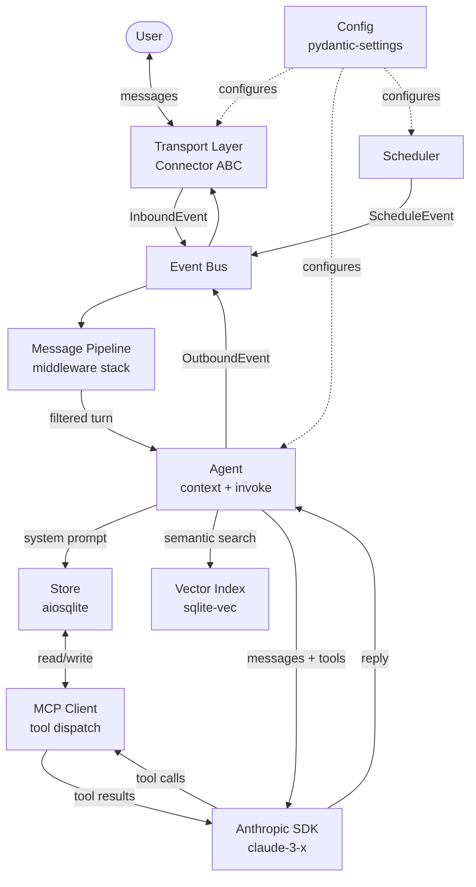

# Reimplementation Plan

This document describes a clean-room reimplementation of awfulclaw in Python, informed by the limitations documented in `ARCHITECTURE.md`. The goal is a significantly more elegant, extensible, and correct system while preserving everything that works well (MCP tooling, the connector abstraction, the memory model, cron scheduling).

## Goals

- **Separation of concerns** — no more 437-line monolith loop; each responsibility lives in its own module with a clear interface
- **Structured data end-to-end** — typed message objects, JSON-lines conversation storage, no regex parsing of markdown files
- **Unified storage** — single SQLite database for all persistent state; markdown files only for human-editable config (SOUL.md, USER.md)
- **Reliable Claude invocation** — Anthropic SDK directly (no subprocess), persistent session, retry logic
- **Relevance-aware context** — ranked context assembly, semantic search via `sqlite-vec`
- **Composable event pipeline** — middleware stack replaces baked-in interceptors; new behaviours added without touching core

## Package Layout

The package uses subdirectories to group files by role. Each directory is a Python package with an `__init__.py` that exports its public interface.

```
agent/
  main.py              # entry point — wiring only
  agent.py             # Agent: context assembly + Claude invocation
  bus.py               # Event bus
  context.py           # ContextAssembler
  pipeline.py          # Pipeline + Middleware ABC
  scheduler.py         # Scheduler async task
  store.py             # Store: unified SQLite layer
  config.py            # Settings via pydantic-settings
  connectors/
    README.md          # What a Connector is, how to implement one, available connectors
    __init__.py        # Connector ABC, Message, InboundEvent, OutboundEvent
    telegram.py        # TelegramConnector
    tui.py             # TUIConnector (Textual)
  middleware/
    README.md          # What middleware is, execution order, how to add a new one
    __init__.py
    rate_limit.py
    secret.py
    location.py
    slash.py
    typing.py
    agent.py           # AgentMiddleware (terminal middleware)
  handlers/
    README.md          # What handlers are, difference from middleware, how to add one
    __init__.py
    schedule.py        # ScheduleHandler
    heartbeat.py       # HeartbeatHandler
    knowledge_flush.py # Daily flush of facts/people/summaries to Obsidian
  mcp/
    README.md          # What MCP servers are, how to add a new one, config/mcp_servers.json format
    __init__.py        # MCPClient
    memory.py          # memory_write + memory_search tools
    schedule.py        # schedule tools
    imap.py            # email tools
    gcal.py            # Google Calendar tools
    owntracks.py       # location tools
    env_manager.py     # env_set / env_keys tools
    skills.py          # skill_read tool
```

This makes every file's role unambiguous without needing filename prefixes — `connectors/telegram.py` is clearly a connector, `middleware/location.py` is clearly middleware.

## Design Principles

1. **Events flow through a pipeline, not a monolith.** Inbound messages enter a middleware chain. Each middleware can transform, intercept, or pass through. New behaviours are new middleware.
2. **One database, one schema.** All persistent state (facts, people, schedules, conversations, tasks) lives in a single SQLite file with a clear schema. Markdown files are config, not storage.
3. **Typed messages everywhere.** Use dataclasses or Pydantic models for every message, turn, and event. No plain dicts, no regex parsing.
4. **SDK over subprocess.** Use the Anthropic Python SDK directly. This gives streaming, proper tool-use round-trips, retry logic, and no process-startup latency.
5. **Async throughout.** No `run_in_executor` wrappers. All I/O is natively async — `httpx.AsyncClient`, `aiosqlite`, async MCP.
6. **Dependency injection over globals.** Components receive their dependencies at construction. No module-level singletons, no import-time side effects.

## Proposed Architecture



The key change from the current design: **the loop no longer owns logic**. It only ticks. Everything else is an event flowing through the bus.

## Component Breakdown

### Config (`config.py`)

**Responsibility:** Load and validate all settings at startup; fail fast on missing required values.

**Design:** Use `pydantic-settings` with a single `Settings` model. Each feature block is a nested model (e.g. `TelegramSettings`, `ImapSettings`). Optional features have `None` as default — code checks `settings.imap is not None` rather than `os.getenv`.

```python
class Settings(BaseSettings):
    model: str = "claude-opus-4-5"
    telegram: TelegramSettings
    imap: ImapSettings | None = None
    gcal: GCalSettings | None = None
    owntracks: OwnTracksSettings | None = None
    poll_interval: int = 5
    idle_interval: int = 60
    briefing_time: time | None = None
    nudge_cooldown: int = 86400
```

**Differs from original:** No 10+ loose `get_*()` functions. One settings object passed through DI.

---

### Store (`store.py`)

**Responsibility:** All persistent state in one `aiosqlite` database. Clean async API; no raw SQL outside this module.

**Schema:**

```sql
-- human-readable identity and profile (still markdown files, but indexed)
-- structured data lives here:

CREATE TABLE facts (
    key TEXT PRIMARY KEY,
    value TEXT NOT NULL,
    embedding BLOB,          -- sqlite-vec float32 vector
    updated_at TEXT NOT NULL
);

CREATE TABLE people (
    id TEXT PRIMARY KEY,
    name TEXT NOT NULL,
    phone TEXT,
    content TEXT NOT NULL,
    embedding BLOB,
    updated_at TEXT NOT NULL
);

CREATE TABLE conversations (
    id INTEGER PRIMARY KEY AUTOINCREMENT,
    channel TEXT NOT NULL,
    role TEXT NOT NULL,       -- 'user' | 'assistant'
    content TEXT NOT NULL,    -- JSON: text or list of content blocks
    timestamp TEXT NOT NULL
);

CREATE TABLE schedules (
    id TEXT PRIMARY KEY,
    name TEXT NOT NULL UNIQUE,
    cron TEXT,
    fire_at TEXT,
    prompt TEXT NOT NULL,
    condition TEXT,
    silent INTEGER NOT NULL DEFAULT 0,
    tz TEXT NOT NULL DEFAULT '',
    created_at TEXT NOT NULL,
    last_run TEXT
);

CREATE TABLE tasks (
    id INTEGER PRIMARY KEY AUTOINCREMENT,
    title TEXT NOT NULL,
    body TEXT NOT NULL,
    done INTEGER NOT NULL DEFAULT 0,
    updated_at TEXT NOT NULL
);

CREATE TABLE kv (
    key TEXT PRIMARY KEY,    -- general-purpose key-value (telegram offset, etc.)
    value TEXT NOT NULL
);
```

**Public API:**

```python
class Store:
    async def get_fact(key) -> str | None
    async def set_fact(key, value, embed=True)
    async def list_facts() -> list[Fact]
    async def search_facts(query, limit=10) -> list[Fact]      # semantic

    async def get_person(id_or_name) -> Person | None
    async def set_person(Person)
    async def search_people(query, limit=10) -> list[Person]   # semantic

    async def add_turn(channel, role, content)
    async def recent_turns(channel, limit=40) -> list[Turn]

    async def list_schedules() -> list[Schedule]
    async def upsert_schedule(Schedule)
    async def delete_schedule(id)

    async def list_open_tasks() -> list[Task]
    async def upsert_task(Task)

    async def kv_get(key) -> str | None
    async def kv_set(key, value)
```

**Differs from original:** No JSON file for schedules, no regex-parsed markdown for conversations, no split between `memory.py` and `db.py`. One module, one file, one schema.

---

### Vector Index (`store.py`, via `sqlite-vec`)

**Responsibility:** Semantic search over facts and people for context assembly.

**Design:** `sqlite-vec` extension loaded at connection time. Embeddings generated via Anthropic's `text-embedding-3-small` (or locally via `sentence-transformers` — configurable). Embeddings stored as BLOB in the same row as the content. Search uses cosine similarity.

```python
async def search_facts(query: str, limit: int = 10) -> list[Fact]:
    embedding = await embed(query)
    return await db.execute(
        "SELECT *, vec_distance_cosine(embedding, ?) AS score "
        "FROM facts ORDER BY score LIMIT ?",
        [embedding, limit]
    )
```

**Differs from original:** Substring `LIKE` search replaced with vector similarity. No more missed matches due to wording differences.

---

### Transport / Connector (`connectors/`)

**Responsibility:** Adapter between a messaging platform and the event bus.

**Design:** Keep the `Connector` ABC from the original — it's good. Make it fully async. Each connector runs its own async task (not a background thread).

```python
class Connector(ABC):
    @abstractmethod
    async def start(self, on_message: Callable[[InboundEvent], Awaitable[None]]) -> None: ...
    @abstractmethod
    async def send(self, to: str, message: OutboundMessage) -> None: ...
    @abstractmethod
    async def send_typing(self, to: str) -> None: ...
    @abstractmethod
    async def stop(self) -> None: ...
```

Two connectors ship in the new implementation:

**`connectors/telegram.py`** — uses `httpx.AsyncClient` with long-polling. Offset stored in `store.kv`. No background threads. Supports text, images, and typing indicators.

**`connectors/tui.py`** — a local terminal UI for development, debugging, and offline use. Built on [Textual](https://github.com/Textualize/textual). Renders a chat-style interface in the terminal with a scrollable message history panel and an input box. Runs as an async Textual app inside its own task; sends `InboundEvent` on Enter and renders `OutboundEvent` messages as they arrive.

```python
class TUIConnector(Connector):
    """
    Terminal chat UI built with Textual.
    Useful for local dev and running the agent without Telegram.
    Start with: uv run python -m agent --connector tui
    """
    async def start(self, on_message):
        self._on_message = on_message
        await self._app.run_async()   # Textual takes over the terminal

    async def send(self, to, message):
        self._app.post_message(AgentReply(message.text))

    async def send_typing(self, to):
        self._app.post_message(TypingIndicator())
```

The TUI connector doubles as the primary development harness — no Telegram credentials needed to run and test the agent locally.

**Differs from original:** Async-native (no `threading.Thread`). Connector pushes events via callback rather than being polled by the gateway. Gateway eliminated — bus takes its place. Connector selected via `--connector telegram|tui` CLI flag (default: `telegram`).

---

### Event Bus (`bus.py`)

**Responsibility:** Decouple producers (connectors, scheduler) from consumers (pipeline, outbound router).

**Design:** Thin wrapper around `asyncio.Queue`. Typed events. Subscribers register for event types.

```python
@dataclass
class InboundEvent:
    channel: str
    message: Message

@dataclass
class OutboundEvent:
    channel: str
    to: str
    message: OutboundMessage

@dataclass
class ScheduleEvent:
    schedule: Schedule
```

**Differs from original:** Replaces the gateway's thread-safe queue. Makes the scheduler a first-class event producer rather than something polled inside the idle tick.

---

### Message Pipeline (`pipeline.py`, `middleware/`)

**Responsibility:** Process inbound events through a middleware stack before they reach the agent.

**Design:** Classic middleware chain. Each middleware receives the event and a `next` callable. Can short-circuit (intercept) or pass through.

```python
class Middleware(Protocol):
    async def __call__(self, event: InboundEvent, next: Next) -> None: ...
```

**Built-in middleware (in order):**
1. `middleware/rate_limit.py` — per-sender rate limiting
2. `middleware/secret.py` — watches for pending secret keys; intercepts the next message as the value
3. `middleware/location.py` — detects `[Location: lat, lon]` format; writes to store; stops chain
4. `middleware/slash.py` — handles `/schedules`, `/restart`; stops chain
5. `middleware/typing.py` — sends typing indicator before passing through
6. `middleware/agent.py` — invokes the agent; attaches reply to event

New behaviours (e.g. a `/remind` command) are a new file in `middleware/` — `pipeline.py` and `main.py` are never touched.

**Differs from original:** Interceptors extracted from `loop.py`. No shared mutable closure state between interceptors.

---

### Agent (`agent.py`)

**Responsibility:** Build context and invoke Claude; return a reply.

**Design:** Two sub-components: `ContextAssembler` and `ClaudeClient`.

```python
class Agent:
    async def reply(self, turn: Turn, channel: str) -> str: ...
    async def invoke(self, prompt: str, history: list[Turn] = []) -> str: ...
```

**Differs from original:** `reply()` is the main path (message → response); `invoke()` is used by the scheduler for prompt-driven turns. Both go through the same `ClaudeClient`.

---

### Context Assembler (`context.py`)

**Responsibility:** Build the system prompt from available memory, ranked by relevance.

**Design:**

1. Always-included sections (no size budget): identity, current time, SOUL, capabilities, USER profile
2. Budget-allocated sections (fill remaining space by relevance score):
   - Facts: scored by semantic similarity to incoming message + recency
   - People: scored by name mention + semantic similarity
   - Tasks: scored by recency
   - Schedules: always included (small, bounded)
3. Total budget: `model_context_limit - estimated_history_tokens - 2000` (not a fixed 8000)

```python
class ContextAssembler:
    async def build(self, message: str, sender: str | None, channel: str) -> str: ...
```

**Differs from original:** Relevance scoring replaces crude "drop oldest facts" truncation. Budget scales with actual conversation length rather than a fixed cap.

---

### Claude Client (`claude_client.py`)

**Responsibility:** Invoke Claude via the Anthropic SDK; handle tool-use round-trips, retries, streaming.

**Design:** Uses `anthropic.AsyncAnthropic`. No subprocess. Tool calls dispatched to the MCP client. Exponential backoff on `APIStatusError` (529, 529) and network errors.

```python
class ClaudeClient:
    async def complete(
        self,
        messages: list[MessageParam],
        system: str,
        tools: list[ToolParam],
    ) -> str: ...
```

Internal tool-use loop:
```
while True:
    response = await anthropic.messages.create(...)
    if response.stop_reason == "tool_use":
        results = await mcp_client.dispatch(response.tool_calls)
        messages += [assistant_turn(response), tool_results_turn(results)]
    else:
        return response.text
```

**Differs from original:** No subprocess, no stdin/stdout serialization, no sentinel markers. Native tool-use loop. Retry logic. Streaming support (can send partial replies).

---

### MCP Client (`mcp_client.py`)

**Responsibility:** Manage MCP server connections and dispatch tool calls.

**Design:** Uses the official `mcp` Python SDK's client. Servers defined in `config/mcp_servers.json` (same format as today). Each server connected at startup as a persistent process via `StdioServerParameters`. Tool catalogue fetched at connection time and passed to Claude as `tools=`.

```python
class MCPClient:
    async def connect_all(self, config_path: Path) -> None: ...
    async def list_tools(self) -> list[ToolParam]: ...
    async def call_tool(self, name: str, arguments: dict) -> ToolResult: ...
    async def reload_if_changed(self) -> bool: ...
```

**Differs from original:** No `--mcp-config` flag on subprocess. Persistent connections rather than re-spawning every turn. Tool catalogue is live and doesn't require config regeneration.

---

### Scheduler (`scheduler.py`)

**Responsibility:** Fire due schedules by posting `ScheduleEvent` to the bus.

**Design:** Runs as an independent async task. Sleeps until the next due schedule, wakes, posts the event, sleeps again. No polling loop comparing timestamps every 60 seconds.

```python
class Scheduler:
    async def run(self, bus: Bus, store: Store) -> None:
        while True:
            schedules = await store.list_schedules()
            next_due = earliest_due(schedules)
            if next_due:
                sleep_until(next_due.fire_time)
                await bus.post(ScheduleEvent(next_due))
            else:
                await asyncio.sleep(60)
```

Schedule events are handled by `handlers/schedule.py` (not in the message pipeline) which invokes `agent.invoke(schedule.prompt)` and optionally posts the reply as an `OutboundEvent`. Heartbeat logic lives in `handlers/heartbeat.py`.

**Differs from original:** Scheduler is event-driven, not polled. No coupling to the idle tick. Schedule storage in SQLite (consistent with everything else).

---

### Core Loop (`main.py`)

**Responsibility:** Wire everything together and run. Nothing else.

```python
async def main():
    settings = Settings()
    store = await Store.connect(settings.db_path)
    bus = Bus()
    mcp = MCPClient()
    await mcp.connect_all(settings.mcp_config)
    claude = ClaudeClient(settings.model, mcp)
    assembler = ContextAssembler(store)
    agent = Agent(claude, assembler, store)

    pipeline = Pipeline([
        RateLimitMiddleware(),
        SecretCaptureMiddleware(store),
        LocationMiddleware(store),
        SlashCommandMiddleware(store),
        TypingMiddleware(),
        AgentMiddleware(agent),
    ])

    connector = TelegramConnector(settings.telegram, store)
    scheduler = Scheduler()

    async with asyncio.TaskGroup() as tg:
        tg.create_task(connector.start(bus.post))
        tg.create_task(scheduler.run(bus, store))
        tg.create_task(bus.run(pipeline, connector))
        tg.create_task(mcp.watch_config(settings.mcp_config))
```

**Differs from original:** `main.py` is ~30 lines of wiring, not 437 lines of logic.

---

## Data Philosophy

The app is a **coordination layer**, not a data store. External systems are the canonical source of truth for their respective domains:

| Domain | Canonical source |
|--------|-----------------|
| Long-form notes and knowledge | Obsidian |
| Events and scheduling | Google Calendar |
| Tasks and to-dos | Obsidian or a dedicated task manager |
| Email | IMAP |
| Contacts | People profiles (MCP tool) |

The agent reads from and writes to these systems via MCP. It does not replace them.

### SQLite as working memory

The local SQLite database is a **hot cache** — fast, structured storage that the agent can query during context assembly without making external API calls on every turn. It holds:

- **Facts** — things the agent has learned about the user and their world (preferences, context, state)
- **People** — contact profiles and relationship context
- **Conversation history** — recent turns for in-context recall
- **Coordination state** — poll offsets, pending secrets, schedule timing

This data is ephemeral in the sense that it serves the agent's immediate reasoning. It is not the user's authoritative record of anything.

### Obsidian as long-term knowledge store

Facts and people profiles are written out to Obsidian daily via `handlers/knowledge_flush.py`. This gives the user a human-readable, searchable, permanent record of everything the agent has learned — living alongside their own notes in Obsidian rather than locked inside the app's database.

The daily flush writes:
- One note per person in `Contacts/` (updated in place)
- A rolling `Agent Knowledge/facts.md` updated with current facts
- A daily conversation summary to `Agent Logs/YYYY-MM-DD.md`

On first run or after a database reset, the agent can rebuild its working knowledge by reading these Obsidian notes back in.

## Memory and Storage Redesign

| Current | New |
|---------|-----|
| `memory/schedules.json` | `schedules` table in SQLite |
| `memory/conversations/YYYY-MM-DD.md` | `conversations` table in SQLite + daily summary flushed to Obsidian |
| `memory/tasks/*.md` | Removed — tasks live in the user's task manager, read via MCP |
| `memory/awfulclaw.db` facts/people | Same tables, same file, extended with embeddings; flushed daily to Obsidian |
| Regex parsing of markdown | Typed `Turn` objects, JSON content field |
| `.telegram_offset` file | `kv` table |

**What stays as markdown files** (human-edited config, not program state):
- `memory/SOUL.md` — personality
- `memory/USER.md` — user profile
- `memory/HEARTBEAT.md` — idle nudge prompt

---

## Implementation Phases

### Phase 1: Core scaffolding
- `Settings` via pydantic-settings
- `Store` with full schema and async API
- `ClaudeClient` with SDK, tool-use loop, retry
- `MCPClient` with persistent connections
- Smoke test: single-turn invoke from a script

### Phase 2: Connectors and bus
- `bus.py` with typed events
- `connectors/telegram.py` (async, offset in store.kv)
- `connectors/tui.py` (Textual-based, for local dev without Telegram)
- Basic `pipeline.py` with `middleware/agent.py` only
- End-to-end: receive message → Claude reply → send (works with both connectors)

### Phase 3: Context and memory
- `context.py` (`ContextAssembler`) with budget-based ranking
- `sqlite-vec` embedding + semantic search
- Full system prompt with SOUL, USER, facts, people, tasks, schedules

### Phase 4: Middleware
- `middleware/secret.py`
- `middleware/location.py`
- `middleware/slash.py`
- `middleware/rate_limit.py`
- `middleware/typing.py`

### Phase 5: Scheduler
- `schedules` table + cron evaluation
- `scheduler.py` async task
- `handlers/schedule.py`, `handlers/heartbeat.py`
- `handlers/knowledge_flush.py` — daily Obsidian export of facts, people, conversation summary
- Daily briefing

### Phase 6: Idle and heartbeat
- Heartbeat as a schedule (not special-cased)
- Idle nudge cooldown via `kv` table

### Phase 7: Feature parity
- Location/timezone updates (OwnTracks)
- Email triage
- MCP config hot-reload
- `/restart` slash command
- Startup briefing

### Phase 8: Migration
- Import script: read `schedules.json` → insert into new DB
- Import script: read `conversations/YYYY-MM-DD.md` → insert turns into new DB
- SOUL.md and USER.md copied as-is
- facts/people DB migrated via SQL

---

## What to Reuse

| Component | Verdict | Notes |
|-----------|---------|-------|
| `connector.py` Connector ABC | Reuse, adapt | Make async; becomes `connectors/__init__.py` |
| `telegram.py` | Reuse, adapt | Move to `connectors/telegram.py`; replace `requests` with `httpx.AsyncClient` |
| `scheduler.py` cron logic | Reuse | Extract `get_due` / `should_wake` into `scheduler.py` |
| `context.py` prompt sections | Reuse text | Replace assembly logic; keep in `context.py` |
| MCP server implementations | Reuse, move | Move into `mcp/` subdirectory (`mcp/imap.py`, `mcp/gcal.py`, etc.) |
| `config/mcp_servers.json` | Reuse as-is | Format unchanged |
| `memory/SOUL.md`, `USER.md` | Reuse as-is | |
| `env_utils.py` | Reuse as-is | |
| `location.py` | Reuse as-is | |
| `loop.py` | Discard | Logic extracted into pipeline middleware |
| `gateway.py` | Discard | Replaced by bus + async connectors |
| `claude.py` | Discard | Replaced by SDK-based ClaudeClient |
| `memory.py` | Discard | Replaced by Store |
| `db.py` | Discard | Replaced by Store |
| `briefings.py` | Discard | Daily briefing becomes a regular schedule |
